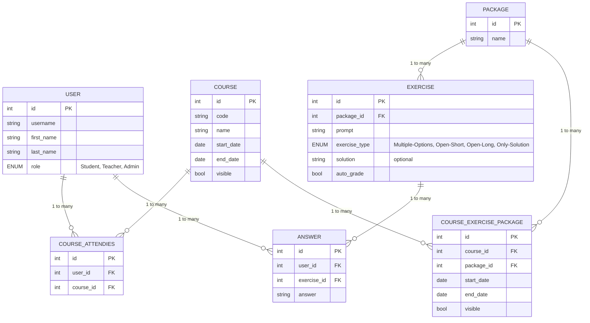

# MVP Design Document
This document outlines the scope, key features, techologies, structure and testing protocol for the MVP of the project.

## Scope
The MVP environment is focused on `mathematics` exercises with LaTeX formulas support. `Students`, `teachers` and `admins` can log in to see their own views.

### The views
#### Student
The student view consist of a list of courses they are attending and a list of due exercise packages from their courses.
Clicking a course will hide other courses exercises. There is an options to display past, current and future exercises.

#### Teacher
The teacher view consist of a list of courses that they are a part of and a list of exercise packages from their courses.
Clicking a course will hide other courses exercises.
There is an options to display past, current and future exercises.
There is options to add a course and an exercise.
Double clicking a course or an exercise package opens an options menu where one can modify content, access and visibility and delete it.
One can also click the three dots that appear on hover to modify or delete the unit.

#### Admin
Ability to create, delete and reset accounts, courses and exercise packages.

## Key features
- Student and Teacher, Admin views/accounts
- Courses that "store" exercise packages
- Exercise packages that display formulas cleanly
- teachers can create invite codes that students can use to join a course
- teachers can invite students to courses
- students have a class tag that can be used for mass invitation/leaving
- Courses and exercise packages can have a set date ranges where they are active.

## Technologies
Frontend: React, LaTeX.js
Backend: Node, Express, Sequelize
Database: PostgreSQL

## Structure
This will be expanded in other documents when the time comes.
The project will be containerized and will have Frontend and Backend as separate containers. The database will be hosted separately.
The project code structure will follow fullstack best practices.
### Database
This is a preliminary idea for the database structure:

[//]: # (
User:
id: int
username: string
first_name: string
last_name: string
role: ENUM[Student, Teacher, Admin])

[//]: # (
Package:
id: int
name: string)

[//]: # (
exercise:
id: int
package_id: id[Package]
prompt: string
exercise_type: ENUM[Multiple-Options,Open-Short,Open-Long,Only-Solution]
solution: string [optional]
auto_grade: bool)

[//]: # (
Course:
id: int
code: string
name: string
start_date: date
end_date: date
visible: bool)

[//]: # (
Course_Attendies:
id: int
user_id: id[User])

[//]: # (
Course_Exercise_package:
id: int
course_id: id[Course]
package_id: id[Package]
start_date: date
end_date: date
visible: bool)

[//]: # (
Answer:
id: int
user_id: id[User]
exercise_id: id[Exercise]
answer: answer)
